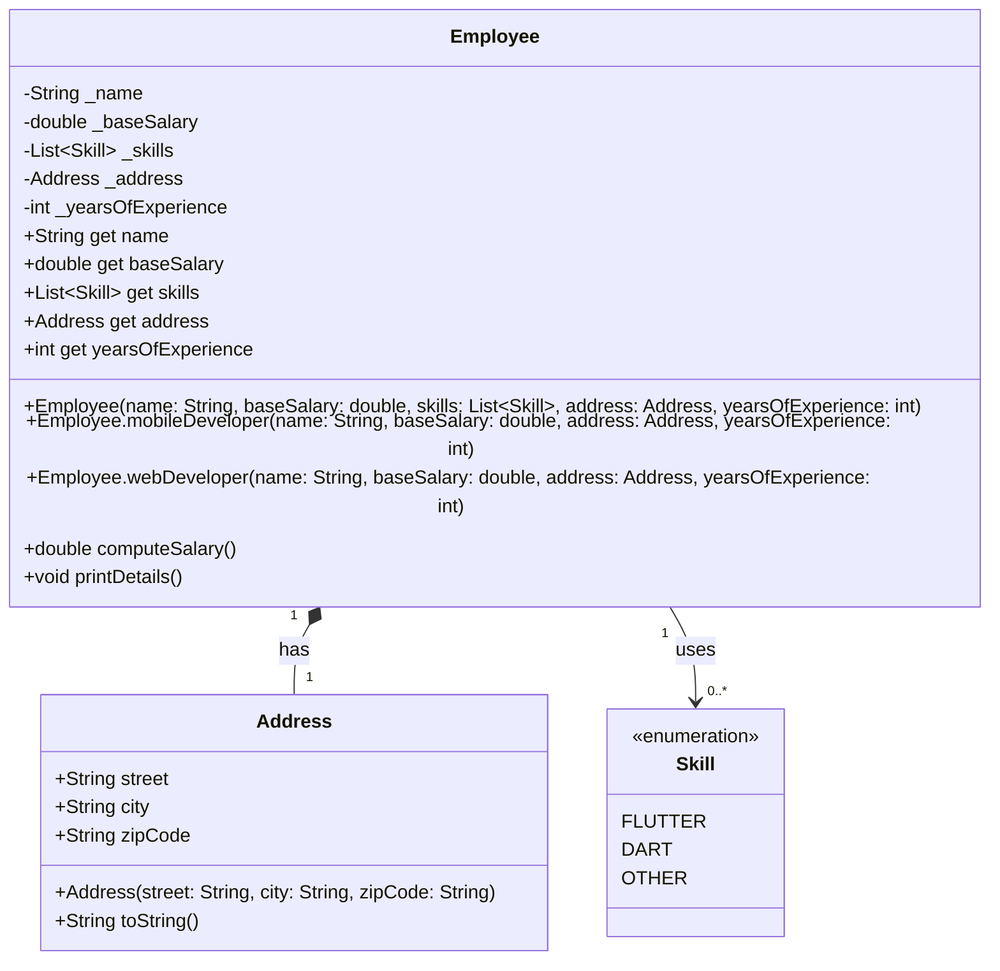

# EX-1: Employee Class - UML Class Diagram

## Class Diagram



## Relationship Explanations

### 1. Employee ←→ Address (Composition)
- **Type**: Composition (`*--`)
- **Multiplicity**: 1 Employee to 1 Address
- **Reasoning**: Each employee has exactly one address. The address is an integral part of the employee data. In this implementation, the address is owned by the employee.

### 2. Employee ←→ Skill (Association)
- **Type**: Association (`-->`)
- **Multiplicity**: 1 Employee to 0 or more Skills
- **Reasoning**: An employee can have multiple skills from the Skill enum. This is a "uses" relationship - the employee uses/has these skills.

## Class Details

### Employee
- **Private Attributes:**
  - `_name`: Employee name (final)
  - `_baseSalary`: Base salary amount (final)
  - `_skills`: List of skills (final)
  - `_address`: Employee address (final)
  - `_yearsOfExperience`: Years of experience (final)

- **Constructors:**
  - **Default Constructor**: Accepts all parameters
  - **Named Constructor `mobileDeveloper`**: Automatically assigns FLUTTER and DART skills
  - **Named Constructor `webDeveloper`**: Automatically assigns DART and OTHER skills

- **Public Methods:**
  - `computeSalary()`: Calculates total salary based on base salary, experience, and skills
  - `printDetails()`: Displays all employee information
  - Getters for all attributes

### Address
- **Immutable value object** representing employee location
- Contains street, city, and zipCode
- All fields are public and final (const constructor)

### Skill (Enum)
- **FLUTTER**: Flutter framework skill (+$5,000)
- **DART**: Dart programming language skill (+$3,000)
- **OTHER**: Other general skills (+$1,000)

## Salary Computation Rules

The `computeSalary()` method calculates salary as follows:

```
Total Salary = Base Salary + Experience Bonus + Skill Bonuses
```

- **Base Salary**: $40,000 (typically)
- **Experience Bonus**: $2,000 × years of experience
- **Skill Bonuses**:
  - FLUTTER: +$5,000
  - DART: +$3,000
  - OTHER: +$1,000

### Example Calculation:
```dart
Employee with:
- Base Salary: $40,000
- Years of Experience: 5
- Skills: [FLUTTER, DART]

Calculation:
$40,000 (base) + ($2,000 × 5) + $5,000 + $3,000 = $58,000
```

## Named Constructor Benefits

### Mobile Developer Constructor
```dart
Employee.mobileDeveloper('Ronan', 40000, address, 5);
```
- Automatically assigns FLUTTER and DART skills
- Perfect for creating mobile developers without manually specifying skills
- Reduces code duplication and potential errors

### Web Developer Constructor
```dart
Employee.webDeveloper('Dara', 40000, address, 2);
```
- Automatically assigns DART and OTHER skills
- Convenient for creating web developers
- Maintains consistency in skill assignment

## Design Principles

1. **Encapsulation**: All attributes are private with public getters
2. **Immutability**: All fields are final (cannot be changed after creation)
3. **Named Constructors**: Provide convenient ways to create specific employee types
4. **Const Objects**: Address can be created as const for better performance
5. **Type Safety**: Uses enum for skills instead of strings
6. **Business Logic**: Salary computation encapsulated in the class

## Usage Example

```dart
// Using default constructor
const address = Address(
  street: '123 Main St',
  city: 'Phnom Penh',
  zipCode: '12000'
);

var emp1 = Employee(
  'Sokea',
  40000,
  [Skill.FLUTTER, Skill.DART],
  address,
  3
);

// Using named constructor
var emp2 = Employee.mobileDeveloper('Ronan', 40000, address, 5);

// Compute salary
print('Salary: \$${emp2.computeSalary()}'); // Outputs computed salary
emp2.printDetails(); // Displays all details
```

## Key Features

1. **Flexible Creation**: Multiple constructors for different use cases
2. **Automatic Skill Assignment**: Named constructors assign appropriate skills
3. **Salary Transparency**: Clear rules for salary computation
4. **Immutable Design**: Once created, employee data cannot be changed
5. **Type Safety**: Enum ensures only valid skills can be assigned
