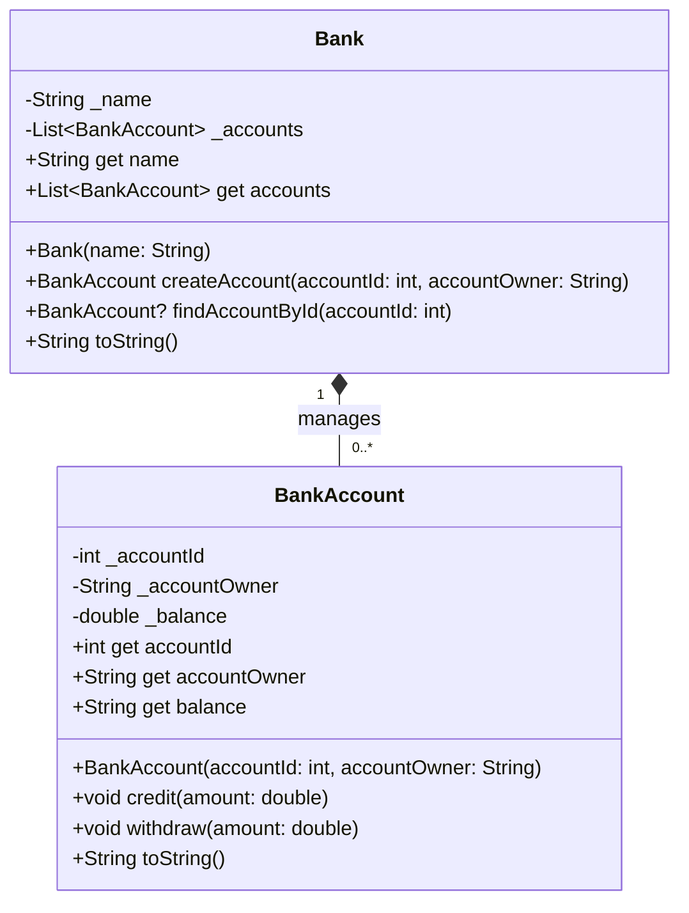

# EX-2: Bank System - UML Class Diagram

## Class Diagram



## Relationship Explanation

### Composition (Strong Ownership)
The relationship between `Bank` and `BankAccount` is **Composition** (indicated by the filled diamond `*--`).

**Reasons:**
1. **Lifecycle Dependency**: `BankAccount` objects are created by the `Bank` class through the `createAccount()` method
2. **Strong Ownership**: The `Bank` owns and manages its accounts - accounts don't exist independently
3. **Exclusive Containment**: Each account belongs to exactly one bank
4. **Lifecycle Control**: When a bank ceases to exist, its accounts would also cease to exist

### Key Points:
- Bank has a **1 to many (0..*)** relationship with BankAccount
- Bank creates and manages all BankAccount instances
- Bank enforces business rules (e.g., unique account IDs)
- BankAccount cannot exist without a Bank context in this implementation

## Class Details

### BankAccount
- **Private Attributes:**
  - `_accountId`: Unique identifier (final)
  - `_accountOwner`: Account holder name (final)
  - `_balance`: Current balance (mutable)

- **Public Methods:**
  - `credit()`: Adds money to account (validates positive amount)
  - `withdraw()`: Removes money from account (validates sufficient balance)
  - Getters for all attributes

### Bank
- **Private Attributes:**
  - `_name`: Bank name (final)
  - `_accounts`: List of all BankAccount objects

- **Public Methods:**
  - `createAccount()`: Factory method to create accounts with validation
  - `findAccountById()`: Retrieves account by ID
  - Getters for name and accounts (returns unmodifiable list)

## Usage Example

```dart
Bank myBank = Bank(name: "CADT Bank");
BankAccount account = myBank.createAccount(100, 'Ronan');
account.credit(100);
account.withdraw(50);
```
