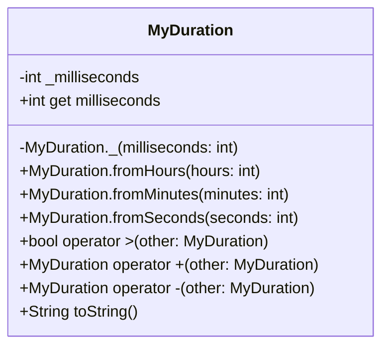

# EX-3: MyDuration Class - UML Class Diagram

## Class Diagram



## Class Details

### MyDuration
A custom immutable duration class similar to Dart's built-in Duration class.

- **Private Attributes:**
  - `_milliseconds`: Internal storage in milliseconds (final)

- **Constructors:**
  - `MyDuration._()`: Private constructor for internal use
  - `MyDuration.fromHours()`: Creates duration from hours
  - `MyDuration.fromMinutes()`: Creates duration from minutes
  - `MyDuration.fromSeconds()`: Creates duration from seconds

- **Operators:**
  - `>`: Compare if this duration is greater than another
  - `+`: Add two durations, returns new MyDuration
  - `-`: Subtract duration, throws exception if result would be negative

- **Methods:**
  - `toString()`: Converts to readable format (X hours, Y minutes, Z seconds)

## Key Concepts Demonstrated

### 1. Immutability
- The `_milliseconds` field is `final`
- No setters are provided
- All operations return new instances
- Once created, a MyDuration object cannot be modified

```dart
MyDuration d1 = MyDuration.fromHours(2);
// d1 cannot be changed, it will always represent 2 hours
```

### 2. Operator Overloading
Custom operators make the class intuitive to use:

```dart
MyDuration d1 = MyDuration.fromHours(3);
MyDuration d2 = MyDuration.fromMinutes(45);

// Comparison operator
bool isGreater = d1 > d2; // true

// Addition operator
MyDuration total = d1 + d2; // 3 hours, 45 minutes

// Subtraction operator
MyDuration diff = d1 - d2; // 2 hours, 15 minutes
```

### 3. Private Constructor Pattern
- `MyDuration._()` is private (underscore prefix)
- Used internally by operators to create new instances
- External code must use named constructors
- Provides control over object creation

### 4. Validation
All constructors and operations validate constraints:
- Duration must be ≥ 0
- Subtraction that would result in negative throws exception
- Ensures data integrity

## Conversion Logic

### Input Conversions
```
Hours to milliseconds:    hours × 60 × 60 × 1000
Minutes to milliseconds:  minutes × 60 × 1000
Seconds to milliseconds:  seconds × 1000
```

### Output Conversion (toString)
```
1. milliseconds → seconds:  ms / 1000
2. seconds → minutes:       seconds / 60
3. minutes → hours:         minutes / 60
4. Format: "X hours, Y minutes, Z seconds"
```

## Operation Examples

### Creation
```dart
MyDuration d1 = MyDuration.fromHours(3);      // 3 hours
MyDuration d2 = MyDuration.fromMinutes(45);   // 45 minutes
MyDuration d3 = MyDuration.fromSeconds(90);   // 1 minute, 30 seconds
```

### Comparison
```dart
MyDuration d1 = MyDuration.fromHours(2);
MyDuration d2 = MyDuration.fromMinutes(90);

print(d1 > d2);  // true (120 min > 90 min)
```

### Addition
```dart
MyDuration d1 = MyDuration.fromHours(1);
MyDuration d2 = MyDuration.fromMinutes(30);
MyDuration total = d1 + d2;

print(total);  // "1 hours, 30 minutes, 0 seconds"
```

### Subtraction
```dart
MyDuration d1 = MyDuration.fromHours(3);
MyDuration d2 = MyDuration.fromMinutes(45);
MyDuration diff = d1 - d2;

print(diff);  // "2 hours, 15 minutes, 0 seconds"
```

### Error Handling
```dart
MyDuration d1 = MyDuration.fromMinutes(30);
MyDuration d2 = MyDuration.fromHours(1);

try {
  MyDuration diff = d1 - d2;  // Would be negative
} catch (e) {
  print(e);  // "Cannot subtract: result would be negative!"
}
```

## Design Patterns

### 1. Value Object Pattern
- Immutable by design
- Equality based on value, not identity
- No side effects from operations

### 2. Factory Pattern
- Named constructors act as factory methods
- Different ways to create the same type
- Clear intent in object creation

### 3. Fluent Interface
- Operations return new instances
- Can be chained (though not demonstrated in exercise)
```dart
MyDuration total = d1 + d2 + d3;  // Chainable
```

## Advantages Over Simple int/double

1. **Type Safety**: Cannot accidentally add duration to other numbers
2. **Clear Intent**: Code reads naturally (d1 > d2 vs milliseconds1 > milliseconds2)
3. **Encapsulation**: Internal representation hidden (could change to nanoseconds)
4. **Validation**: Built-in constraints ensure valid durations
5. **Readable Output**: Automatic conversion to human-readable format

## Comparison with Dart's Duration

This custom implementation is similar to Dart's built-in Duration class:

| Feature | MyDuration | Dart Duration |
|---------|------------|---------------|
| Immutable | ✅ | ✅ |
| Multiple constructors | ✅ | ✅ |
| Operator overloading | ✅ (>, +, -) | ✅ (>, +, -, *, ~/) |
| Validation | ✅ | ✅ |
| Comparison | ✅ | ✅ |
| Readable output | ✅ | ✅ |

## Usage Best Practices

1. **Always use named constructors** - don't try to access private constructor
2. **Handle subtraction exceptions** - wrap in try-catch when subtracting
3. **Use comparison operators** - more readable than comparing milliseconds
4. **Let operations create new instances** - don't try to modify existing durations
5. **Use toString() for display** - automatic formatting

## Complete Example

```dart
void main() {
  // Create durations
  MyDuration workDay = MyDuration.fromHours(8);
  MyDuration lunch = MyDuration.fromMinutes(60);
  MyDuration meeting = MyDuration.fromMinutes(90);
  
  // Calculate actual work time
  MyDuration actualWork = workDay - lunch - meeting;
  
  // Display
  print('Work day: $workDay');
  print('Lunch break: $lunch');
  print('Meeting: $meeting');
  print('Actual work time: $actualWork');
  
  // Comparison
  if (meeting > lunch) {
    print('Meeting was longer than lunch!');
  }
}
```

This design demonstrates strong understanding of:
- Object-oriented principles
- Immutability concepts
- Operator overloading in Dart
- Error handling and validation
- Clean API design
