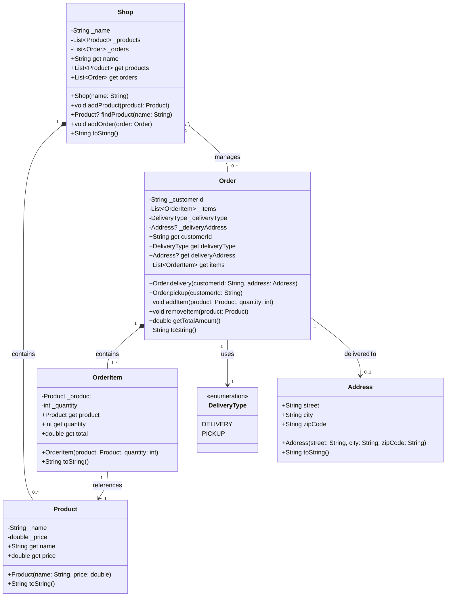

# EX-4: Shop Management System - UML Class Diagram

## Class Diagram



## Relationship Explanations

### 1. Shop ←→ Product (Composition)
- **Type**: Composition (`*--`)
- **Multiplicity**: 1 Shop to 0 or more Products
- **Reasoning**: Shop owns and manages its product catalog. Products are part of the shop's inventory.

### 2. Shop ←→ Order (Aggregation)
- **Type**: Aggregation (`o--`)
- **Multiplicity**: 1 Shop to 0 or more Orders
- **Reasoning**: Shop manages orders, but orders can conceptually exist independently (they belong to customers). The relationship is weaker than composition.

### 3. Order ←→ OrderItem (Composition)
- **Type**: Composition (`*--`)
- **Multiplicity**: 1 Order to 1 or more OrderItems
- **Reasoning**: OrderItems are integral parts of an Order and cannot exist without it. When an order is deleted, its items are also deleted.

### 4. Order ←→ DeliveryType (Dependency/Association)
- **Type**: Association (`-->`)
- **Reasoning**: Each order has a delivery type (DELIVERY or PICKUP). This is an enum value used to classify orders.

### 5. Order ←→ Address (Optional Association)
- **Type**: Association (`-->`)
- **Multiplicity**: 0 or 1 Order to 0 or 1 Address
- **Reasoning**: Only delivery orders have an address. Pickup orders have null address. This is a nullable relationship.

### 6. OrderItem ←→ Product (Association)
- **Type**: Association (`-->`)
- **Multiplicity**: 1 OrderItem to 1 Product
- **Reasoning**: OrderItem references a Product but doesn't own it. The same product can be referenced by multiple order items.

## Class Details

### Product
- **Immutable class** representing items for sale
- Contains name and price
- Used as a reference by OrderItem

### Address
- **Immutable class** for delivery locations
- Contains street, city, zipCode
- Only used for delivery orders

### OrderItem
- **Value object** linking products to orders
- Stores product reference and quantity
- Calculates item total (price × quantity)

### Order
- **Two named constructors:**
  - `Order.delivery()`: For orders with delivery address
  - `Order.pickup()`: For pickup orders (no address)
- Manages list of OrderItems
- Calculates total amount including delivery fee ($5 for delivery)

### Shop
- **Central management class**
- Maintains product catalog
- Tracks all orders
- Provides search and add functionality

### DeliveryType (Enum)
- **DELIVERY**: Order will be delivered to an address
- **PICKUP**: Order will be picked up at the shop

## Key Features

1. **Smart Item Management**: Adding duplicate products updates quantity instead of creating separate items
2. **Delivery Fee**: Automatically adds $5 for delivery orders
3. **Type Safety**: Uses enum for delivery types instead of strings
4. **Immutability**: Product and Address are immutable (const constructors)
5. **Validation**: Quantity must be positive, delivery orders must have address

## Usage Example

```dart
// Create shop
Shop myShop = Shop(name: "CADT Online Shop");

// Add products
const laptop = Product(name: "Laptop", price: 999.99);
myShop.addProduct(laptop);

// Create delivery order
const address = Address(
  street: "123 Main St",
  city: "Phnom Penh",
  zipCode: "12000"
);

Order order = Order.delivery(
  customerId: "CUST001",
  address: address
);

order.addItem(laptop, 2);
myShop.addOrder(order);

print(order.getTotalAmount()); // Product total + $5 delivery fee
```

## Design Decisions

1. **Named Constructors**: Different order types (delivery vs pickup) have different requirements
2. **Nullable Address**: Type system enforces that only delivery orders can have addresses
3. **Encapsulation**: All fields are private with public getters
4. **Unmodifiable Lists**: External code cannot modify internal collections
5. **Enum for Type Safety**: Prevents invalid delivery type values
